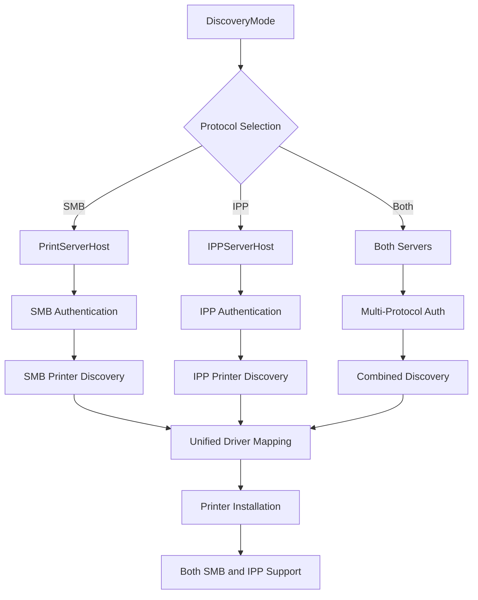

# 👨‍💼 A created a new Beta that supports Airprint 

https://github.com/hov172/MacNetworkPrinterSharedUtility/releases/tag/MacNetPrinterSharedUtilityBeta

# 👨‍💼 Maintain and Build

**Jesus M. Ayala - ITS Help Desk Manager, Sarah Lawrence College**

> For bugs or enhancements, please open an issue.

---

# 🖨️ NetworkPrinter macOS Application

NetworkPrinter is a comprehensive macOS application designed to help users discover and install network printers from both SMB/Windows print servers and IPP (Internet Printing Protocol) servers. The application features a modern SwiftUI interface with comprehensive driver selection capabilities and is built to robustly read and apply settings managed via configuration profiles.


---

## Settings


---

## Driver Selection - Driver path Mapped from Google Sheet


---
## ✨ Features

* **🎨 Modern SwiftUI Interface**: Clean, intuitive design with smooth animations and responsive layouts
* **🔍 Multi-Protocol Discovery**: Automatically discover printers on SMB/Windows servers AND IPP/IPPS servers
* **🧠 Advanced Driver Selection**: Automatic suggestions, manual PPD selection, and CUPS auto-detection
* **📡 Real-time Status Updates**: Live printer status monitoring and installation progress tracking
* **🔎 Search and Filter**: Quickly find printers by name or location across all protocols
* **📦 Batch Operations**: Select and install multiple printers at once from any protocol
* **🔐 MDM Configuration**: Supports managed deployment via macOS configuration profiles
* **🪵 Comprehensive Logging**: Detailed logs for troubleshooting and diagnostics
* **🌐 Protocol Flexibility**: Support for SMB/CIFS, IPP/IPPS, and mixed environments

---

## 🏗️ Architecture

The app is built using a modern, modular service-based architecture:

* **PrinterManager**: Handles multi-protocol discovery, installation, and status updates
* **PreferencesManager**: Reads and manages both local and MDM-supplied preferences for all protocols
* **Service Layer**: Modular services for SMB discovery, IPP discovery, installation, and driver operations
* **UI Components**: SwiftUI-based views like `PrinterListView`, `DriverSelectionView`, `PrinterHeaderView`
* **Styling System**: Unified design language with consistent colors, fonts, and components
* **Protocol Services**: Dedicated `PrinterDiscoveryService` (SMB) and `IPPDiscoveryService` (IPP)

---

## 🚀 Configuration Setup

### 📘 Quick Start Guide

1. Copy the file: `NetworkPrinter/Resources/NetworkPrinterSettings.mobileconfig`
2. Edit placeholders:

   * `<string>Your Organization</string>` → `<string>Acme Corporation</string>`
   * Replace `YOUR_PRINTSERVER_HOSTNAME_OR_IP` and other placeholders
   * Configure both SMB and IPP settings as needed
3. Deploy via MDM (Jamf, Intune, etc.) or manually:
   ```bash
   sudo profiles -I -F NetworkPrinterSettings.mobileconfig
   ```

### 🔧 Complete Configuration Examples

#### 🏢 Example 1: Mixed Protocol Business Setup

**Scenario**: Business with both SMB Windows print server and modern IPP server

```xml
<?xml version="1.0" encoding="UTF-8"?>
<!DOCTYPE plist PUBLIC "-//Apple//DTD PLIST 1.0//EN" "http://www.apple.com/DTDs/PropertyList-1.0.dtd">
<plist version="1.0">
<dict>
    <key>PayloadDisplayName</key>
    <string>Network Printer Settings</string>
    <key>PayloadIdentifier</key>
    <string>com.acmecorp.networkprinter.configuration</string>
    <key>PayloadOrganization</key>
    <string>Acme Corporation</string>
    <key>PayloadRemovalDisallowed</key>
    <false/>
    <key>PayloadScope</key>
    <string>System</string>
    <key>PayloadType</key>
    <string>Configuration</string>
    <key>PayloadUUID</key>
    <string>12345678-1234-1234-1234-123456789012</string>
    <key>PayloadVersion</key>
    <integer>1</integer>
    <key>PayloadContent</key>
    <array>
        <dict>
            <key>PayloadDescription</key>
            <string>Configures Network Printer application settings for mixed SMB/IPP environment</string>
            <key>PayloadDisplayName</key>
            <string>Network Printer App Preferences</string>
            <key>PayloadIdentifier</key>
            <string>com.networkprinter.preferences</string>
            <key>PayloadOrganization</key>
            <string>Acme Corporation</string>
            <key>PayloadType</key>
            <string>com.apple.ManagedClient.preferences</string>
            <key>PayloadUUID</key>
            <string>12345678-1234-1234-1234-123456789013</string>
            <key>PayloadVersion</key>
            <integer>1</integer>
            <key>PayloadEnabled</key>
            <true/>
            <key>PayloadContent</key>
            <dict>
                <key>com.networkprinter.preferences</key>
                <dict>
                    <key>Forced</key>
                    <array>
                        <dict>
                            <key>mcx_preference_settings</key>
                            <dict>
                                <!-- Multi-Protocol Discovery -->
                                <key>DiscoveryMode</key>
                                <string>Both</string>
                                
                                <!-- SMB Server Configuration -->
                                <key>PrintServerHost</key>
                                <string>printserver.acmecorp.com</string>
                                <key>PrintServerPort</key>
                                <integer>445</integer>
                                <key>PrintServerDomain</key>
                                <string>ACME</string>
                                
                                <!-- IPP Server Configuration -->
                                <key>IPPServerHost</key>
                                <string>ippserver.acmecorp.com</string>
                                <key>IPPServerPort</key>
                                <integer>631</integer>
                                <key>IPPUseSSL</key>
                                <false/>
                                <key>IPPRequireAuthentication</key>
                                <true/>
                                
                                <!-- User authentication -->
                                <key>RequireAuthentication</key>
                                <true/>
                                <key>DefaultDomain</key>
                                <string>ACME</string>
                                
                                <!-- User permissions (flexible) -->
                                <key>AllowUserServerChange</key>
                                <true/>
                                <key>AllowUserInstall</key>
                                <true/>
                                <key>AllowUserUninstall</key>
                                <true/>
                                
                                <!-- Installation preferences -->
                                <key>AutoInstallPrinters</key>
                                <false/>
                                <key>AutoInstallDefaultPrinter</key>
                                <string></string>
                                
                                <!-- Troubleshooting -->
                                <key>EnableDetailedLogging</key>
                                <false/>
                                <key>AllowFallbackWithGenericSuggestion</key>
                                <true/>
                                
                                <!-- Driver mappings work for BOTH SMB and IPP -->
                                <key>PrinterDriverMappings</key>
                                <dict>
                                    <!-- SMB Printers -->
                                    <key>CORP-HP-LaserJet-FL1</key>
                                    <string>/Library/Printers/PPDs/Contents/Resources/HP LaserJet Pro 4015n.ppd.gz</string>
                                    <key>CORP-Canon-Copier-FL2</key>
                                    <string>/Library/Printers/PPDs/Contents/Resources/Canon iR-ADV C5535i PS.ppd.gz</string>
                                    
                                    <!-- IPP Printers -->
                                    <key>Office-Printer-Main</key>
                                    <string>/Library/Printers/PPDs/Contents/Resources/HP Color LaserJet.ppd.gz</string>
                                    <key>Reception-Color-Printer</key>
                                    <string>/Library/Printers/PPDs/Contents/Resources/Canon Color ImageCLASS.ppd.gz</string>
                                </dict>
                                
                                <!-- Remote management disabled for simplicity -->
                                <key>DriverMappingsURL</key>
                                <string></string>
                                <key>GoogleSheetsID</key>
                                <string></string>
                                <key>GoogleSheetsAPIKey</key>
                                <string></string>
                                <key>GoogleSheetsRange</key>
                                <string>printers!A:B</string>
                            </dict>
                        </dict>
                    </array>
                </dict>
            </dict>
        </dict>
    </array>
</dict>
</plist>
```

**Key Features**:
- Discovers printers from both SMB and IPP servers
- Users can modify server settings if needed
- Authentication configured for both protocols
- Driver mappings work for both SMB and IPP printers
- Fallback to generic drivers allowed

#### 🌐 Example 2: IPP-Only Modern Environment

**Scenario**: Modern organization using only IPP/CUPS servers

```xml
<key>mcx_preference_settings</key>
<dict>
    <!-- IPP-Only Discovery -->
    <key>DiscoveryMode</key>
    <string>IPP</string>
    
    <!-- IPP Server Configuration -->
    <key>IPPServerHost</key>
    <string>cups.moderncompany.com</string>
    <key>IPPServerPort</key>
    <integer>631</integer>
    <key>IPPUseSSL</key>
    <true/>
    <key>IPPRequireAuthentication</key>
    <true/>
    
    <!-- Authentication -->
    <key>RequireAuthentication</key>
    <true/>
    <key>DefaultDomain</key>
    <string>MODERN</string>
    
    <!-- IPP Printer Mappings -->
    <key>PrinterDriverMappings</key>
    <dict>
        <key>Office-Color-Printer</key>
        <string>/Library/Printers/PPDs/Contents/Resources/HP Color LaserJet.ppd.gz</string>
        <key>Engineering-Plotter</key>
        <string>/Library/Printers/PPDs/Contents/Resources/HP DesignJet.ppd.gz</string>
        <key>Reception-MFP</key>
        <string>/Library/Printers/PPDs/Contents/Resources/Canon Color ImageCLASS.ppd.gz</string>
    </dict>
</dict>
```

#### 🏭 Example 3: SMB-Only Legacy Environment

**Scenario**: Traditional Windows-based print server environment

```xml
<key>mcx_preference_settings</key>
<dict>
    <!-- SMB-Only Discovery -->
    <key>DiscoveryMode</key>
    <string>SMB</string>
    
    <!-- SMB Server Configuration -->
    <key>PrintServerHost</key>
    <string>legacy-printserver.company.local</string>
    <key>PrintServerPort</key>
    <integer>445</integer>
    <key>PrintServerDomain</key>
    <string>COMPANY</string>
    
    <!-- Authentication -->
    <key>RequireAuthentication</key>
    <true/>
    <key>DefaultDomain</key>
    <string>COMPANY</string>
    
    <!-- Locked-down permissions -->
    <key>AllowUserServerChange</key>
    <false/>
    <key>AllowUserInstall</key>
    <true/>
    <key>AllowUserUninstall</key>
    <false/>
</dict>
```

### 🔧 Advanced Configuration

| Key | Type | Description | Default | Protocols |
|-----|------|-------------|---------|-----------|
| `DiscoveryMode` | String | Discovery mode: "SMB", "IPP", or "Both" | `"Both"` | Both |
| `PrintServerHost` | String | Hostname or IP address of SMB print server | `""` | SMB |
| `PrintServerPort` | Integer | SMB port for print server connection | `445` | SMB |
| `PrintServerDomain` | String | Domain name for SMB authentication | `""` | SMB |
| `IPPServerHost` | String | Hostname or IP address of IPP print server | `""` | IPP |
| `IPPServerPort` | Integer | IPP server port (631 for HTTP, 443 for HTTPS) | `631` | IPP |
| `IPPUseSSL` | Boolean | Use HTTPS/TLS for secure IPP connections | `false` | IPP |
| `IPPRequireAuthentication` | Boolean | Require authentication for IPP access | `true` | IPP |
| `RequireAuthentication` | Boolean | Whether users must authenticate to access SMB printers | `false` | SMB |
| `DefaultDomain` | String | Pre-fills domain field in authentication dialog | `""` | Both |
| `AllowUserServerChange` | Boolean | Can users modify server settings | `true` | Both |
| `AllowUserInstall` | Boolean | Can users install printers | `true` | Both |
| `AllowUserUninstall` | Boolean | Can users remove installed printers | `true` | Both |
| `AutoInstallPrinters` | Boolean | Automatically install all discovered printers | `false` | Both |
| `AutoInstallDefaultPrinter` | String | Printer to set as system default | `""` | Both |
| `EnableDetailedLogging` | Boolean | Enables detailed application logging | `false` | Both |
| `AllowFallbackWithGenericSuggestion` | Boolean | Allow generic drivers when specific unavailable | `false` | Both |

### 🔧 Feature Implementation
```swift
// Multi-protocol printer discovery
class PrinterManager: ObservableObject {
    @Published var printers: [NetworkPrinter] = []
    private let smbDiscoveryService = PrinterDiscoveryService()
    private let ippDiscoveryService = IPPDiscoveryService()
    
    func discoverPrinters() {
        let mode = preferencesManager.discoveryMode
        
        switch mode {
        case .smb:
            // SMB-only discovery
            Task {
                await discoverSMBPrinters()
            }
        case .ipp:
            // IPP-only discovery
            Task {
                await discoverIPPPrinters()
            }
        case .both:
            // Parallel discovery from both protocols
            Task {
                async let smbPrinters = discoverSMBPrinters()
                async let ippPrinters = discoverIPPPrinters()
                
                let allPrinters = await smbPrinters + ippPrinters
                await MainActor.run {
                    self.printers = allPrinters
                }
            }
        }
    }
    
    private func discoverSMBPrinters() async -> [NetworkPrinter] {
        // SMB discovery implementation
    }
    
    private func discoverIPPPrinters() async -> [NetworkPrinter] {
        // IPP discovery implementation using IPPDiscoveryService
    }
}

// Unified driver mapping system
class PreferencesManager: ObservableObject {
    func getSuggestedDriverPath(for printerName: String) -> String? {
        // Works for both SMB and IPP printer names
        // Priority: MDM → Remote JSON → Google Sheets → Bundled
        
        // Try exact match first
        if let exactMatch = printerDriverMappings[printerName] {
            return exactMatch
        }
        
        // Try fuzzy matching for both protocols
        return findFuzzyMatch(for: printerName)
    }
}
```

### 🔧 Protocol-Specific Configuration

#### SMB/CIFS Configuration
```xml
<!-- Traditional Windows print server -->
<key>DiscoveryMode</key>
<string>SMB</string>
<key>PrintServerHost</key>
<string>windows-printserver.domain.com</string>
<key>PrintServerDomain</key>
<string>DOMAIN</string>
<key>RequireAuthentication</key>
<true/>
```

#### IPP/IPPS Configuration
```xml
<!-- Modern CUPS or IPP server -->
<key>DiscoveryMode</key>
<string>IPP</string>
<key>IPPServerHost</key>
<string>cups.company.com</string>
<key>IPPServerPort</key>
<integer>631</integer>
<key>IPPUseSSL</key>
<false/>
<key>IPPRequireAuthentication</key>
<true/>
```

#### Mixed Environment Configuration
```xml
<!-- Support both protocols -->
<key>DiscoveryMode</key>
<string>Both</string>
<key>PrintServerHost</key>
<string>smb-server.company.com</string>
<key>IPPServerHost</key>
<string>ipp-server.company.com</string>
<key>RequireAuthentication</key>
<true/>
<key>IPPRequireAuthentication</key>
<true/>
```

---

### 📝 Configuration Profile Setup Steps

#### Step 1: Generate UUIDs
Generate unique UUIDs for your configuration:
```bash
# Generate UUID for main payload
uuidgen
# Generate UUID for preferences payload  
uuidgen
```

#### Step 2: Choose Your Protocol Strategy
**Decision Matrix:**

| Environment | SMB Server | IPP Server | Discovery Mode | Best For |
|-------------|------------|------------|----------------|----------|
| **Traditional** | ✅ | ❌ | `SMB` | Windows-based environments |
| **Modern** | ❌ | ✅ | `IPP` | CUPS/Linux-based environments |
| **Mixed** | ✅ | ✅ | `Both` | Organizations in transition |
| **Cloud** | ❌ | ✅ | `IPP` | Cloud-native printing solutions |

#### Step 3: Configure Server Settings
Set your print server details based on chosen protocols:

**For SMB environments:**
```xml
<key>DiscoveryMode</key>
<string>SMB</string>
<key>PrintServerHost</key>
<string>your-smb-server.domain.com</string>
<key>PrintServerPort</key>
<integer>445</integer>
<key>PrintServerDomain</key>
<string>YOUR-DOMAIN</string>
```

**For IPP environments:**
```xml
<key>DiscoveryMode</key>
<string>IPP</string>
<key>IPPServerHost</key>
<string>your-ipp-server.domain.com</string>
<key>IPPServerPort</key>
<integer>631</integer>
<key>IPPUseSSL</key>
<false/>
<key>IPPRequireAuthentication</key>
<true/>
```

**For mixed environments:**
```xml
<key>DiscoveryMode</key>
<string>Both</string>
<!-- Configure both SMB and IPP settings -->
```

#### Step 4: Configure Driver Mappings
The same driver mapping system works for both protocols:

```xml
<key>PrinterDriverMappings</key>
<dict>
    <!-- SMB printer names -->
    <key>CORP-HP-4015-FL1</key>
    <string>/Library/Printers/PPDs/Contents/Resources/HP LaserJet Pro 4015n.ppd.gz</string>
    
    <!-- IPP printer names -->
    <key>Office-Printer-Main</key>
    <string>/Library/Printers/PPDs/Contents/Resources/HP Color LaserJet.ppd.gz</string>
    
    <!-- Generic mappings work for both -->
    <key>Reception-Printer</key>
    <string>/Library/Printers/PPDs/Contents/Resources/Canon Color ImageCLASS.ppd.gz</string>
</dict>
```

#### Step 5: Deploy Profile
Deploy using your MDM or manually:
```bash
# Manual deployment
sudo profiles -I -F YourNetworkPrinterSettings.mobileconfig

# Verify deployment
profiles -P | grep networkprinter

# Check settings (both protocols)
defaults read com.networkprinter.preferences DiscoveryMode
defaults read com.networkprinter.preferences PrintServerHost
defaults read com.networkprinter.preferences IPPServerHost
```

---

### 🎯 Configuration Decision Matrix

| Requirement | Small Business | Enterprise | Kiosk/Lab | Remote Managed | Mixed Environment |
|-------------|---------------|------------|-----------|----------------|-------------------|
| **Protocols supported** | SMB or IPP | Both | Both | Both | Both |
| **User can change server** | ✅ | ❌ | ❌ | ❌ | ✅ |
| **User can install printers** | ✅ | ✅ | ❌ | ✅ | ✅ |
| **User can uninstall printers** | ✅ | ❌ | ❌ | ✅ | ✅ |
| **Auto-install all printers** | ❌ | ❌ | ✅ | ❌ | ❌ |
| **Authentication required** | ✅ | ✅ | ❌ | ✅ | ✅ |
| **Detailed logging** | ❌ | ❌ | ❌ | ✅ | ❌ |
| **Profile removal allowed** | ✅ | ❌ | ❌ | ✅ | ✅ |
| **Driver management** | Static | Static + Sheets | Static | Remote JSON | Remote + Static |
| **Fallback drivers** | ✅ | ❌ | ✅ | ✅ | ✅ |
| **Discovery mode** | Single | Both | Both | Both | Both |

### 🔧 Common Use Cases

#### 🏢 Use Case 1: Mixed Protocol Environment

* 500+ users, Windows domain + CUPS servers, both SMB and IPP support

#### 🌐 Use Case 2: Cloud-Native IPP

* Modern organization, CUPS-based cloud printing, IPP-only

#### 🏭 Use Case 3: Legacy SMB Migration

* Transitioning from Windows print servers to IPP, temporary both protocols

#### 🤝 Use Case 4: Hybrid Management

* Static mappings for core printers, remote JSON for dynamic updates, support both protocols

---

## 🔑 Configuration Key Reference

### Multi-Protocol Discovery

| Key                 | Type    | Description                 | Protocols |
| ------------------- | ------- | --------------------------- | --------- |
| `DiscoveryMode`     | String  | "SMB", "IPP", or "Both"     | Both      |
| `PrintServerHost`   | String  | Hostname/IP of SMB server   | SMB       |
| `PrintServerPort`   | Integer | SMB port (default: 445)     | SMB       |
| `PrintServerDomain` | String  | Auth domain for SMB         | SMB       |
| `IPPServerHost`     | String  | Hostname/IP of IPP server   | IPP       |
| `IPPServerPort`     | Integer | IPP port (default: 631)     | IPP       |
| `IPPUseSSL`         | Boolean | Use IPPS (SSL/TLS)          | IPP       |

### Authentication

| Key                     | Type    | Description            | Protocols |
| ----------------------- | ------- | ---------------------- | --------- |
| `RequireAuthentication` | Boolean | Prompt for SMB creds   | SMB       |
| `IPPRequireAuthentication` | Boolean | Prompt for IPP creds | IPP       |
| `DefaultDomain`         | String  | Default domain prefill | Both      |

### 🔐 Domain Configuration & Authentication

The application supports comprehensive domain configuration to streamline user authentication across both protocols:

#### Domain Settings Overview

| Setting | Purpose | User Experience | Protocols |
|---------|---------|-----------------|-----------|
| `PrintServerDomain` | Server's domain for SMB connections | Used internally for SMB communication | SMB |
| `DefaultDomain` | Pre-fills authentication dialog | Users see this value in domain field | Both |
| `IPPRequireAuthentication` | Controls IPP authentication | Shows/hides IPP login dialog | IPP |

#### Multi-Protocol Authentication Flow

1. **Discovery mode determines** which protocols are used
2. **For SMB printers**: Uses `RequireAuthentication` and `DefaultDomain`
3. **For IPP printers**: Uses `IPPRequireAuthentication` setting
4. **Mixed environments**: May require authentication for both protocols
5. **Domain validation** occurs before attempting printer discovery

#### Configuration Examples

**Example 1: Mixed Environment Authentication**
```xml
<key>DiscoveryMode</key>
<string>Both</string>
<key>PrintServerDomain</key>
<string>CORP</string>
<key>RequireAuthentication</key>
<true/>
<key>IPPRequireAuthentication</key>
<true/>
<key>DefaultDomain</key>
<string>CORP</string>
```

**Example 2: IPP-Only with Authentication**
```xml
<key>DiscoveryMode</key>
<string>IPP</string>
<key>IPPRequireAuthentication</key>
<true/>
<key>DefaultDomain</key>
<string>COMPANY</string>
```

**Example 3: SMB-Only Traditional Setup**
```xml
<key>DiscoveryMode</key>
<string>SMB</string>
<key>PrintServerDomain</key>
<string>DOMAIN.LOCAL</string>
<key>RequireAuthentication</key>
<true/>
<key>DefaultDomain</key>
<string>DOMAIN</string>
```

#### User Experience Benefits

- **Protocol awareness**: Users understand which servers require authentication
- **Reduced friction**: Pre-configured domains reduce typing
- **Consistent experience**: Same authentication flow regardless of protocol
- **Error prevention**: Pre-configured domains prevent authentication failures
- **MDM control**: IT can lock authentication settings to prevent user changes

#### Common Multi-Protocol Configurations

| Scenario | DiscoveryMode | SMB Auth | IPP Auth | Notes |
|----------|---------------|----------|----------|-------|
| Windows + CUPS | `Both` | `true` | `true` | Both protocols need auth |
| Public IPP | `IPP` | N/A | `false` | Open IPP server |
| Secure Mixed | `Both` | `true` | `true` | All printers require auth |
| Legacy Only | `SMB` | `true` | N/A | Traditional Windows domain |

### Installation

| Key                                  | Type    | Description                      | Protocols |
| ------------------------------------ | ------- | -------------------------------- | --------- |
| `AutoInstallPrinters`                | Boolean | Auto-add all discovered printers | Both      |
| `AutoInstallDefaultPrinter`          | String  | Printer to set as system default | Both      |
| `AllowFallbackWithGenericSuggestion` | Boolean | Allow generic driver fallback    | Both      |

### User Permissions

| Key                     | Type    | Description                    | Protocols |
| ----------------------- | ------- | ------------------------------ | --------- |
| `AllowUserServerChange` | Boolean | Let user modify server field   | Both      |
| `AllowUserInstall`      | Boolean | Enable user-initiated installs | Both      |
| `AllowUserUninstall`    | Boolean | Allow user to remove printers  | Both      |

### Driver Management (Protocol Agnostic)

| Key                     | Type       | Description                  | Protocols |
| ----------------------- | ---------- | ---------------------------- | --------- |
| `PrinterDriverMappings` | Dictionary | Printer name → path to PPD   | Both      |
| `DriverMappingsURL`     | String     | Remote JSON with driver info | Both      |
| `GoogleSheetsID`        | String     | Google Sheets spreadsheet ID | Both      |
| `GoogleSheetsAPIKey`    | String     | API Key for Sheet access     | Both      |
| `GoogleSheetsRange`     | String     | Range (e.g., `printers!A:B`) | Both      |

### Advanced

| Key                     | Type    | Description               | Protocols |
| ----------------------- | ------- | ------------------------- | --------- |
| `EnableDetailedLogging` | Boolean | Enables detailed app logs | Both      |

---

## 🧪 Deployment Instructions

### Jamf Pro

1. Create or edit a Configuration Profile
2. Use "Application & Custom Settings"
3. Upload your `.mobileconfig`
4. Configure discovery mode and both SMB/IPP settings as needed
5. Assign to desired scope and deploy

### Microsoft Intune

1. Devices → Configuration profiles → Create profile
2. Platform: **macOS**, Profile type: **Custom**
3. Upload `.mobileconfig`, assign, and deploy

### Manual

```bash
sudo profiles -I -F NetworkPrinterSettings.mobileconfig
```

To check settings:

```bash
# Check discovery mode and servers
defaults read com.networkprinter.preferences DiscoveryMode
defaults read com.networkprinter.preferences PrintServerHost
defaults read com.networkprinter.preferences IPPServerHost
```

---

## 🧰 Logging

### 📄 File Logs

* Location: `~/Library/Application Support/com.slc.NetworkPrinter/Logs/NetworkPrinter_debug.log`
* Logs contain timestamps, log levels, protocol information, and operation details

### 🖥️ Console Logs

* Use Console.app → filter by `com.slc.NetworkPrinter` or `cfprefsd`
* Protocol-specific filtering available:
  * SMB: Search for "PrinterDiscoveryService" or "SMB"
  * IPP: Search for "IPPDiscoveryService" or "IPP"

### Enhanced Logging Commands

```bash
# View live logs for both protocols
log stream --predicate 'subsystem == "com.slc.NetworkPrinter"' --level debug

# Protocol-specific logging
log stream --predicate 'subsystem == "com.slc.NetworkPrinter" and category == "PrinterDiscoveryService"' --level debug
log stream --predicate 'subsystem == "com.slc.NetworkPrinter" and category == "IPPDiscoveryService"' --level debug

# View recent multi-protocol activity
log show --predicate 'subsystem == "com.slc.NetworkPrinter"' --last 1h
```

---

## 🛠️ Troubleshooting

### MDM Settings Not Applying

* Verify profile in System Settings → Profiles
* Restart Mac to reset `cfprefsd`
* Check with:

```bash
profiles -C -v | grep networkprinter
```

### Multi-Protocol Discovery Issues

* **Only SMB printers found**: Check `IPPServerHost` configuration and IPP server connectivity
* **Only IPP printers found**: Check `PrintServerHost` configuration and SMB server connectivity  
* **No printers found**: Verify `DiscoveryMode` is set correctly and both servers are accessible

```bash
# Test SMB connectivity
smbutil view //username:password@smb-server

# Test IPP connectivity  
ippfind -T 5

# Check discovery mode
defaults read com.networkprinter.preferences DiscoveryMode
```

### Driver Mapping Failures

* Check PPD paths work for both SMB and IPP printers
* Enable `EnableDetailedLogging` in preferences
* Verify PPDs in `/Library/Printers/PPDs/Contents/Resources/`
* Test with both SMB and IPP printer names

### Protocol-Specific Authentication Issues

* **SMB Authentication**: Verify `PrintServerDomain` and `DefaultDomain` match your AD
* **IPP Authentication**: Check `IPPRequireAuthentication` setting
* **Mixed Environment**: Ensure both protocol credentials are configured

#### Testing Protocol Configuration:

```bash
# Check SMB configuration
defaults read com.networkprinter.preferences PrintServerHost
defaults read com.networkprinter.preferences PrintServerDomain

# Check IPP configuration
defaults read com.networkprinter.preferences IPPServerHost
defaults read com.networkprinter.preferences IPPRequireAuthentication

# Test SMB connection with domain
smbutil view -I 192.168.1.100 -W DOMAIN //username@server

# Test IPP connection
ippfind -T 5 -x echo "Found: {service_uri}" \;
```

---

## 🔮 Future Roadmap

* Enhanced protocol support (LPR, Google Cloud Print successor)
* Advanced mixed-environment management tools
* Real-time cross-protocol printer job queue visibility
* Enhanced driver auto-detection for IPP printers
* Cloud-based printer management integration
* Improved performance for large mixed environments

---

## 🌟 Additional Features

### 📈 Multi-Protocol Analytics and Reporting

The app includes analytics and reporting features to help IT monitor printer usage across both SMB and IPP protocols.

### 🌈 Protocol-Aware UI

The app's UI adapts to show protocol-specific information, with clear indicators for SMB vs IPP printers and their respective connection methods.

### 🚀 Advanced Multi-Protocol Deployment Options

Support for complex mixed environments with automated deployment via MDM and custom scripts that handle both SMB and IPP configurations.

### 📊 Enhanced Detailed Logging

Comprehensive logging for both protocols with separate log categories for SMB and IPP operations, making troubleshooting easier in mixed environments.

### 📈 Performance Enhancements

Optimized for multi-protocol discovery with parallel processing, intelligent caching, and protocol-specific optimizations for both SMB and IPP.

### 📊 Security Enhancements

Protocol-specific security features including separate authentication methods, encrypted communication support for IPPS, and secure credential management for both protocols.

---

## 🏗️ Enhanced Architecture

The app's enhanced architecture supports multiple protocols seamlessly:

* **PrinterManager**: Orchestrates discovery across both SMB and IPP protocols
* **PreferencesManager**: Manages unified configuration for both protocols
* **PrinterDiscoveryService**: Handles SMB/CIFS printer discovery and validation
* **IPPDiscoveryService**: Dedicated IPP/IPPS printer discovery and management
* **PrinterInstallationService**: Unified installation service supporting both protocols
* **UI Components**: Protocol-aware views with visual indicators for printer types
* **Unified Driver System**: Same driver mapping system works across all protocols

---

## 📊 Complete Configuration Keys Reference Chart

### 🎯 Enhanced Configuration Keys Overview

This comprehensive chart explains every available configuration key for both SMB and IPP protocols:

| Category | Key | Type | Default | Description | User Impact | Protocols | MDM Manageable |
|----------|-----|------|---------|-------------|-------------|-----------|----------------|
| **🔍 Discovery** | `DiscoveryMode` | String | `"Both"` | Discovery mode: "SMB", "IPP", or "Both" | Controls which protocols are used | Both | ✅ |
| **🖥️ SMB Server** | `PrintServerHost` | String | `""` | Hostname or IP address of SMB print server | Required for SMB printer discovery | SMB | ✅ |
| **🖥️ SMB Server** | `PrintServerPort` | Integer | `445` | SMB port for print server connection | Usually 445 for SMB/CIFS | SMB | ✅ |
| **🖥️ SMB Server** | `PrintServerDomain` | String | `""` | Domain name for SMB authentication | Used internally for server communication | SMB | ✅ |
| **🌐 IPP Server** | `IPPServerHost` | String | `""` | Hostname or IP address of IPP print server | Required for IPP printer discovery | IPP | ✅ |
| **🌐 IPP Server** | `IPPServerPort` | Integer | `631` | IPP server port (631 for HTTP, 443 for HTTPS) | Standard IPP ports | IPP | ✅ |
| **🌐 IPP Server** | `IPPUseSSL` | Boolean | `false` | Use HTTPS/TLS for secure IPP connections | Enables encrypted communication | IPP | ✅ |
| **🌐 IPP Server** | `IPPRequireAuthentication` | Boolean | `true` | Require authentication for IPP access | Shows/hides IPP login dialog | IPP | ✅ |
| **🔐 Auth** | `RequireAuthentication` | Boolean | `false` | Whether users must authenticate for SMB | Shows/hides SMB login dialog | SMB | ✅ |
| **🔐 Auth** | `DefaultDomain` | String | `""` | Pre-fills domain field in authentication dialog | Reduces user typing, improves UX | Both | ✅ |
| **👤 Permissions** | `AllowUserServerChange` | Boolean | `true` | Can users modify server settings | Shows/hides server configuration UI | Both | ✅ |
| **👤 Permissions** | `AllowUserInstall` | Boolean | `true` | Can users install printers | Shows/hides install buttons | Both | ✅ |
| **👤 Permissions** | `AllowUserUninstall` | Boolean | `true` | Can users remove installed printers | Shows/hides uninstall buttons | Both | ✅ |
| **🤖 Auto-Install** | `AutoInstallPrinters` | Boolean | `false` | Automatically install all discovered printers | Installs without user interaction | Both | ✅ |
| **🤖 Auto-Install** | `AutoInstallDefaultPrinter` | String | `""` | Printer to set as system default | Sets macOS default printer | Both | ✅ |
| **🚗 Drivers** | `PrinterDriverMappings` | Dictionary | `{}` | Printer name → path to PPD (works for both protocols) | Provides specific drivers for all printers | Both | ✅ |
| **🚗 Drivers** | `DriverMappingsURL` | String | `""` | Remote JSON with driver info (protocol agnostic) | Enables dynamic driver updates | Both | ✅ |
| **📊 Sheets** | `GoogleSheetsID` | String | `""` | Google Sheets spreadsheet ID (supports both protocols) | Enables Google Sheets driver management | Both | ✅ |
| **📊 Sheets** | `GoogleSheetsAPIKey` | String | `""` | API Key for Sheet access | Required for Sheets authentication | Both | ✅ |
| **📊 Sheets** | `GoogleSheetsRange` | String | `"printers!A:B"` | Range (e.g., `printers!A:B`) | Defines data location in spreadsheet | Both | ✅ |
| **🔧 Advanced** | `EnableDetailedLogging` | Boolean | `false` | Enables detailed application logging | Affects performance, aids troubleshooting | Both | ✅ |
| **🔧 Advanced** | `AllowFallbackWithGenericSuggestion` | Boolean | `false` | Allow generic drivers when specific unavailable | Enables installation with basic drivers | Both | ✅ |

---

### 🔄 Enhanced Configuration Key Relationships



---

### 💡 Enhanced Best Practices for Multi-Protocol Configuration

#### ✅ Do's
- **Always set DiscoveryMode** - Determines which protocols are used
- **Configure appropriate servers** - Set both SMB and IPP servers for mixed environments
- **Use unified driver mappings** - Same mappings work for both protocols
- **Test both protocols separately** - Ensure each works independently
- **Enable logging during testing** - Set EnableDetailedLogging: true
- **Use protocol-specific naming** - Help distinguish SMB vs IPP printers

#### ❌ Don'ts
- **Don't forget discovery mode** - Missing DiscoveryMode defaults to "Both"
- **Don't mix authentication settings** - Be clear about which protocols need auth
- **Don't ignore protocol-specific ports** - 445 for SMB, 631 for IPP
- **Don't assume same credentials** - SMB and IPP may use different auth
- **Don't enable logging in production** - Performance impact
- **Don't forget SSL settings** - IPP can use encrypted IPPS

---

### 🔍 Enhanced Configuration Troubleshooting Guide

| Issue | Likely Cause | Check These Keys | Solution | Protocols |
|-------|-------------|------------------|----------|-----------|
| **No printers found** | Server connection | `DiscoveryMode`, `PrintServerHost`, `IPPServerHost` | Verify both server connections | Both |
| **Only SMB printers** | IPP not configured | `IPPServerHost`, `DiscoveryMode` | Configure IPP server settings | IPP |
| **Only IPP printers** | SMB not configured | `PrintServerHost`, `DiscoveryMode` | Configure SMB server settings | SMB |
| **SMB auth fails** | Domain mismatch | `DefaultDomain`, `PrintServerDomain` | Ensure domains match your AD | SMB |
| **IPP auth fails** | Authentication settings | `IPPRequireAuthentication`, `DefaultDomain` | Check IPP auth configuration | IPP |
| **Users can't install** | Permissions | `AllowUserInstall` | Set to `true` or use admin unlock | Both |
| **Wrong drivers selected** | Missing mappings | `PrinterDriverMappings`, `DriverMappingsURL` | Add protocol-specific mappings | Both |
| **Auto-install not working** | Configuration | `AutoInstallPrinters`, `AutoInstallDefaultPrinter` | Enable and specify default | Both |
| **Settings not applying** | MDM sync | All managed keys | Restart and check profile installation | Both |

**This comprehensive README now fully reflects the enhanced multi-protocol capabilities of the NetworkPrinter application, supporting both SMB/CIFS and IPP/IPPS environments with unified driver management.**
